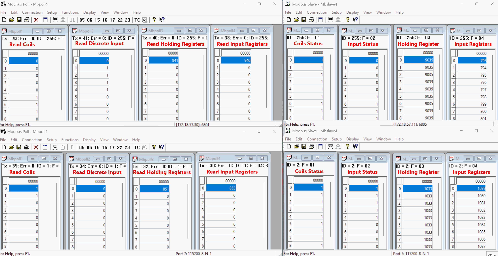

<h1>Libmodbus for MCU</h1>
<p align="center">
  
</p>

**Libmodbus for MCU** aims to adapt the open-source Modbus protocol stack, libmodbus, for resource-constrained MCU platforms. By integrating the real-time operating system (FreeRTOS) and a lightweight TCP/IP stack (LwIP), it provides stable and reliable communication capabilities. The project has been validated on the STM32F429 platform, demonstrating the functionality of both Modbus TCP and Modbus RTU in Master and Slave modes. It's well-suited for applications requiring rapid implementation of Modbus communication on MCUs.

  [](https://www.gnu.org/licenses/old-licenses/lgpl-2.1.html) [](https://en.wikipedia.org/wiki/C_(programming_language))

**English** ｜ [**中文简体**](../README.md)  

## Features

- Supports multiple Modbus RTU masters and slaves

- Supports multiple Modbus TCP masters and slaves
- Adapted for a lightweight TCP/IP stack based on lwIP
- Customized the original libmodbus source code with added hardware abstraction layer (HAL) interfaces
- Platform-independent porting layer for easy adaptation to different MCU platforms

## Supported Platforms

- Alientek Apollo STM32F429 development board (test platform)
- Theoretically supports all MCUs with FreeRTOS and LwIP

## Dependencies

- FreeRTOS：V10.4.6
- lwIP：V2.1.3
- libmodbus：V3.1.11

## How to Use

### Platform Setup

1. Port the RTOS to the target board and ensure it runs correctly

2. Port the LwIP stack and make necessary  configurations in `lwipopts.h` :

   - Set the following options to **1**: `LWIP_SOCKET`、`SO_REUSE`、`LWIP_NETCONN`、`LWIP_SOCKET_SELECT`、`LWIP_POSIX_SOCKETS_IO_NAMES` 
   - Set `LWIP_COMPAT_SOCKETS` to **0**

   > Incorrect configuration of the above options may result in compilation error.

### Porting modbus-port.h

1. In the `arch/modbus-port.h` file, include the target MCU’s header files and redefine the UART and DMA handle types (stUartHalHandle_t, stUartTxDmaHandle_t, stUartRxDmaHandle_t) according to the peripheral definitions of the specific platform, in order to adapt to the platform’s UART and DMA drivers.

2.  Include the corresponding RTOS header files, and redefine the semaphore and message queue types (pstModbusSem_t, pstModbusQueue_t). Also, define the maximum delay constant (MODBUS_MAX_DELAY) and the delay macro (os_delay_ms(ms)) to decouple the RTOS layer from the Modbus protocol stack.

3. If you are using another TCP/IP stack that supports the BSD socket interface (such as **uC/TCP-IP**, **embOS/IP**, etc.), you will need to adapt the modbus_net_xxx interfaces accordingly. For example, map macros like modbus_net_send and modbus_net_recv to the socket functions provided by your TCP/IP stack.

   > **Note: ** if the TCP/IP stack you are using does **not** support the standard BSD socket API, these interfaces **cannot** be adapted directly.

### Porting the Modbus RTU Hardware Abstraction Layer

Libmodbus was originally designed for platforms such as Linux, macOS, FreeBSD, Embox, QNX, and Windows, all of which support standard POSIX I/O interfaces. Its serial communication layer is entirely dependent on these standard interfaces and the underlying OS kernel driver model—interfaces that are typically unavailable in MCU environments.

Therefore, when porting libmodbus to an MCU platform, it is necessary to reimplement the low-level UART driver interfaces, including initialization, transmission, reception, and direction control, etc.

In **Libmodbus for MCU**, a UART device class has been designed, and devices are managed through a device table. Before creating an RTU communication channel, a UART device must be defined and registered with the necessary member variables and callback functions. The structure is defined as follows:

```c
/**
 * @brief UART device structure
 */
typedef struct _UartDevice
{
	/* UART device-specific attributes and configurations */
	char *m_pi8Name; /**< uart device name */
	enum enDevId m_enDevId; /**< uart device id */
	stUartHalHandle_t m_stHalHandle; /**< uart handle */
	stUartTxDmaHandle_t m_stTxDmaHandle; /**< uart tx dma handle */
	stUartRxDmaHandle_t m_stRxDmaHandle; /**< uart rx dma handle */
	unsigned char *m_pu8RecvBuff; /**< uart data receive buff pointer */
	unsigned short m_u16RecvBuffSize; /**< uart data receive buff size */
	unsigned short m_u16RecvLen; /**< length of Modbus frame received via UART */
	unsigned short m_u16ReadLen; /**< length of Modbus data that has been processed */
	unsigned char m_u8RecvDone; /**< uart data receive done flag */
	void* m_pvRecvSem; /**< semaphore for receive completion */
	void* m_pvSendSem; /**< semaphore for send completion */

	/* uart device-specific driver interface */
  int (*m_pFnInit)(struct _UartDevice *l_pstDev, int l_i32Baud, char l_i8Parity, int l_i32DataBit, int l_i32StopBit);
  int (*m_pFnSend)( struct _UartDevice *l_pstDev, unsigned char * l_pu8Datas, unsigned int l_u32Len, unsigned int l_u32Timeout);
	int (*m_pFnRecv)( struct _UartDevice *l_pstDev, unsigned char * l_pu8Datas, unsigned int l_u32Len,unsigned int l_u32Timeout);
	int (*m_pFnFlush)(struct _UartDevice *l_pstDev);
	void (*m_pFnDirSwitch)(struct _UartDevice *l_pstDev, enModbusDir_t l_enDir);
}stUartDevice, *pstUartDevice;
```

When defining a UART device, the following steps are required:

- Assign a **device name**, which will be used in the modbus_new_rtu() function of libmodbus
- Bind a **device ID** for device table management
- Define a **receive buffer** for each device and bind it to the device to receive UART data
- Register callback functions for init, send, recv, flush, and dir_switch operations

After defining the device, you must **implement the five callback functions** for your specific platform. The key porting tasks include:

- In the init callback:

  Initialize the UART and configure DMA interrupts, then create semaphores for send and receive operations.

- In the other callbacks (send, recv, flush, dir_switch):

  Adapt the DMA logic and semaphore handling according to the RTOS and hardware platform being used.

## Testing

### Environment Setup

- Use Modbus debugging tools: **Modbus Poll** and **Modbus Slave**.
- Configure the test host IP as `172.18.57.11`, or modify the connection IP address in the TCP Master task within the test code.
- Ensure the project is based on **FreeRTOS** and **LwIP**, with proper **network connectivity** and **serial port connections**.

### Testing Steps

1. **Add Test Program**

   Add the modbus_test function to the main function and create a test task.

2. **Configure Modbus Poll**

   - In Modbus Poll, create both serial and TCP connections:
     - For serial: select the USB device corresponding to uart2.
     - For TCP: use IP 172.18.57.30 and port 6801.
   - Open windows for the following function codes to monitor communication:
     - Read Coils
     - Read Discrete Inputs
     - Read Holding Registers
     - Read Input Registers

3. **Configure Modbus Slave**

   - In Modbus Slave, similarly create serial and TCP connections.
   - Create address windows for:
     - Coil Status
     - Input Status
     - Holding Registers
     - Input Registers
   - Configure the data to auto-increment or toggle to assist in monitoring communication and value changes.

4. **Observe Serial Output**

   After the system starts running, monitor the debugging tools and serial output. You should see data changing as expected, indicating successful communication.


### Result Verification

- The test results using the Modbus debugging tools are as follows:



- The serial log output is shown below:


## License

This project is licensed under LGPL-2.1 or later.
For more details, please refer to the LICENSE file.

---

# Contact

- Author: William Chen
- Email: william_engineer@outlook.com